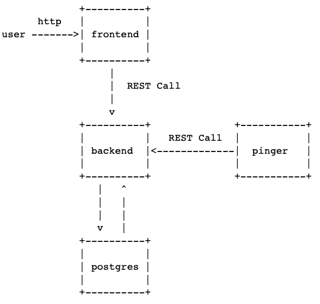

# test-task-for-VK
Test task for VK.

    
Task description (in Russian)

    Для постоянного мониторинга своих контейнеров необходимо приложение, которое будет постоянно отслеживать их состояние.

    Необходимо написать приложение на языках программирования Go и JavaScript(TS), которое получает ip адреса контейнеров docker, пингует их с определенным интервалом и помещает данные в базу данных.
    
    Получение данных о состоянии контейнеров доступно на динамически формируемой веб-странице.

    В результате выполнения задания должны появиться 4 сервиса:

        - Backend-сервис обеспечивает RESTful API для запроса данных из DB и добавления туда новых данных.

        - Frontend-сервис должен быть написан на JS с использованием любой библиотеки пользовательских интерфейсов (предпочтительно React). Берет данные через API Backend и отображает данные по всем IP адресам в виде таблицы: IP адрес, время пинга, дата последней успешной попытки. Для отображения данных в html можно использовать bootstrap или antd или подобное.

        - База данных PostgreSQL.

        - Сервис Pinger. Получает список всех docker-контейнеров, пингует их и отправляет данные в базу через API frontend.

    * Дополнительная сложность: добавление nginx, сервис очередей, использовать netns, отдельный конфиг для сервиса с верификацией.
    
    Результат:
    
        - В результате выполнения задания должны быть созданы Dockerfile для каждого сервиса и общий файл compose, которые собирает эти образы из исходников и запускает их, после чего можно зайти через http на определенный порт и увидеть данные о статусе машин, когда произойдет первый цикл опроса контейнеров.

        - Всё это размещено на github/gitlab в отдельном репозитории c README.md, в котором описан кратко функционал и шаги запуска.
    

It uses `golang-migrate`. When you run `docker-compose up`, it will create the database and run migrations.
After it, you can call
`docker exec -i <container name> pg_dump -U admin -d container_monitoring --schema-only > ./db/schema.sql`
to get the schema.

All DTOs are described in `pkg/model` in `.proto` files. To generate `.go` files run `make`.